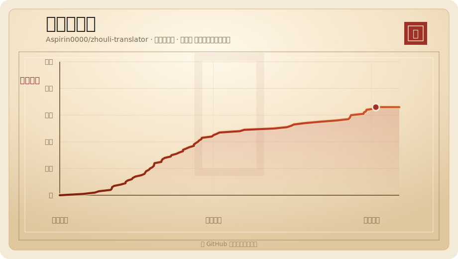

# 合乎周礼 · 潇湘评

<p align="center">
  <strong>问礼 + 释礼 / 拟颦 + 释颦：两套中文梗文案人设，正向改写，也能反向翻回直接人话。</strong>
</p>

<p align="center">
  <a href="https://www.bilibili.com/video/BV12a7N6qE1g/">B站原视频</a>
  ·
  <a href="https://hehuzhouli.com">在线体验</a>
  ·
  <a href="#quick-start">快速开始</a>
  ·
  <a href="#skills">下载 Skill</a>
  ·
  <a href="#deployment">部署</a>
</p>

<p align="center">
  
  
  <a href="https://github.com/Aspirin0000/zhouli-translator">
    
  </a>
  
  
  
  
</p>


## What Is This

`合乎周礼 · 潇湘评` 是一个中文梗文案生成器，也是两套风格的反向解释器。周礼与黛玉是两套并列人设，不是“周礼主功能 + 黛玉附属皮肤”。

它有四个核心方向：

- **问礼**：把普通中文改写成“大周礼时代”流行的周礼白话翻译腔。
- **释礼**：把周礼体翻回直接人话。
- **拟颦**：把普通中文改写成“黛玉体”白话翻译腔。
- **释颦**：把黛玉体翻回直接人话。

两套人设的笑点机制不同：

- **周礼腔**靠论证：先讲一个像古代道理的故事，再把现代小事放进礼法、名分、职分和体面里，一本正经地推出略显荒唐的结论。
- **黛玉腔**靠戳破：不绕圈子论证，直接看穿一句话里的虚伪、委屈、讨好或别扭，再用“罢了”一类收束落下锋芒。

反向模式不会继续整活：释礼拆掉礼法包装，释颦拆掉花泪意象和虚词，只保留原文真正想表达的意思。

在线版本：[hehuzhouli.com](https://hehuzhouli.com)

B站原视频：[B站原视频](https://www.bilibili.com/video/BV12a7N6qE1g/)

这是 [hehuzhouli.com](https://hehuzhouli.com) 原网站作者维护的官方开源仓库。若你是从视频、网页、转载或镜像项目来到这里，这里就是原版网站对应的源码与 Skill 发布处。

这个仓库包含：

- Next.js 网站源码。
- `/api/translate` 服务端生成接口。
- DeepSeek Chat Completions 调用逻辑。
- 周礼/黛玉两套人设的 prompt 构造、视角判定与输出清洗规则。
- 可复制、可下载的 `speak-zhouli` 和 `speak-daiyu` Skill 包。
- 礼帖/释帖/潇湘书笺图片生成与下载逻辑。

仓库不包含真实 API Key、私有日志、线上账号凭据或生产平台的安全配置。

## Highlights

| Capability | Detail |
| --- | --- |
| 双人设 | 周礼腔 + 黛玉腔，Tab 一键切换，两套风格并列维护 |
| 双向转换 | 周礼支持问礼/释礼，黛玉支持拟颦/释颦 |
| 周礼模式 | 温言相劝、大儒辩经、强行圆场、痛心疾首 |
| 黛玉模式 | 娇嗔打趣、夹枪带棒、触景伤怀、孤高拒人 |
| 反向释义 | 直白释义、耐心讲明、潜台词版、锐评拆穿 |
| 三档长度 | 小礼/成礼/大礼与浅愁/清怨/伤逝，覆盖短评到长文 |
| 输出清洗 | 清理模型自述、Markdown、外层引号和“这段话的意思是”类前缀 |
| 演示模式 | 没有 API Key 时仍可预览界面与交互 |
| Skill 分发 | 支持一键复制 Skill 全文和 Markdown 下载 |
| 图片导出 | 将生成结果保存为对应风格的图片卡片 |
| 公开前审计 | 内置脚本扫描明显密钥与私钥块 |

## Star History

<a href="https://github.com/Aspirin0000/zhouli-translator/stargazers">
  
</a>

## Examples

### 问礼示例：普通话 → 周礼体

Input:

```text
疯狂星期四，谁愿请我一食才合乎周礼
```

Output style:

```text
我听闻，古人设宴，并非只为一餐之饱，也是借饭食来观朋友情义。
今日正逢星期四，我开口求一食，看似嘴馋，其实是在给诸位一个行仁义、修情分的机会。
若有人愿意请客，便不是破费，而是以鸡会友，这难道不也合乎周礼吗？
```

### 释礼示例：周礼体 → 直接人话

Input:

```text
我听闻，今日我设此礼门，并非拒人千里，只是怕众人一拥而入，坏了满座通畅。
```

Output style:

```text
我设置次数限制不是为了故意拦人，而是怕接口被刷爆，影响正常用户使用。
```

### 拟颦示例：普通话 → 黛玉体

Input:

```text
那太好了
```

Output style:

```text
好自然是好的，只是这话一出口，我倒先替它多想了两分。旁人只看见热闹，我却偏要瞧见那热闹底下藏着什么。罢了，既说是好，便先当它是好罢。
```

### 释颦示例：黛玉体 → 直接人话

Input:

```text
我原不是那等嘴馋要人请客的人，只是这话说出来，倒要看看谁肯搭这个茬儿。罢了，没人应也不打紧，我自己去买便是。
```

Output style:

```text
我就是想让人请我吃个饭，随口说一句看有没有人接。没人接也无所谓，我自己买。
```

## 两套人设的差异

| 维度 | 周礼腔 | 黛玉腔 |
| --- | --- | --- |
| 核心机制 | 论证：严密推导 → 荒唐结论 | 戳破：一针见血 → 清醒自嘲 |
| 常见开法 | “我听闻”“若按礼法来看”“古人设宴” | “我原不是”“倒也”“罢了”“偏生” |
| 语言重点 | 礼法、名分、职分、体面、责任 | 清醒、别扭、锋芒、寄人篱下、自嘲 |
| 适合场景 | 圆场、辩经、劝说、郑重吐槽 | 回怼、戳破、拒绝、表达委屈或孤高 |
| 禁区 | 伪经典引用、真文言、机械说教 | 舞台动作、哭哭啼啼、周礼式论证 |

### 周礼四种辞气

| 辞气 | 定义 | 使用场景 |
| --- | --- | --- |
| 温言相劝 | 先体谅，再举例劝说 | 劝人、安慰、表达不同意见 |
| 大儒辩经 | 建立貌似严谨的论证，加入反例或反问 | 争辩、吐槽、评论 |
| 强行圆场 | 为行为另立名分，找勉强成立的解释 | 洗白、找借口、幽默解释 |
| 痛心疾首 | 把小事提升到秩序与礼法高度 | 谴责、感叹、表达失望 |

### 黛玉四种语气

| 语气 | 定义 | 使用场景 |
| --- | --- | --- |
| 娇嗔打趣 | 机锋轻巧，底色是亲近不是攻击 | 关系亲近、可以卸下防备的语境 |
| 夹枪带棒 | 一针见血拆穿敷衍、冷落、虚伪 | 对方明显敷衍或有优越感的场合 |
| 触景伤怀 | 由眼前小事清醒联想到命运处境 | 用户话里带无奈或孤独感的场合 |
| 孤高拒人 | 直接说真话，拒绝讨好或退让 | 拒绝、划界限、保留体面 |

### 篇幅档位

| 周礼 | 黛玉 | 说明 |
| --- | --- | --- |
| 小礼 | 浅愁 | 约 70–130 字，像一句高赞短评 |
| 成礼 | 清怨 | 约 150–260 字，有一次转折或完整起承转合 |
| 大礼 | 伤逝 | 约 280–450 字，可层层推进，但不能水文 |

## 输出边界

无论是网页生成还是 Skill 输出，都应默认只返回改写或释义正文。

- 不要把用户的话当成聊天来回应。
- 不要输出“原话太短”“我按某某档位来写”“提示词要求我……”这类创作说明。
- 不要加标题、Markdown、编号列表或括号舞台动作，除非用户明确要求解释。
- 如果原话是在问“怎么说/怎么回复”，要改写这个“求体面说法/想回复”的请求本身，不能直接替用户回答问题。
- 如果模型仍返回自述，服务端会在 `lib/output.ts` 中做一次保守清洗，但更重要的是 prompt 和 Skill 都要避免诱发自述。

## Quick Start

Requirements:

- Node.js 20 or newer.
- A DeepSeek API key for real generation.

Run locally:

```bash
npm install
cp .env.example .env.local
npm run dev
```

Open [http://localhost:3000](http://localhost:3000).

`.env.local`:

```env
DEEPSEEK_API_KEY=sk-your-key-here
DEEPSEEK_MODEL=deepseek-v4-flash
MAX_OUTPUT_TOKENS=720
```

If `DEEPSEEK_API_KEY` is missing, the app falls back to local demo output and does not call DeepSeek.

## Project Structure

```text
app/
  api/translate/route.ts       Server-side generation endpoint
  page.tsx                     Main UI and card export flow
lib/
  prompt.ts                    周礼/黛玉 prompt assembly and perspective rules
  output.ts                    Shared model-output cleanup helpers
  cardDownload.ts              Unique card download filenames
public/
  downloads/                   Public Skill assets
  images/                      README and website images
scripts/
  public-audit.mjs             Public-release secret scan
  run-zhouli-batch.mjs         Batch regression runner
  *.test.ts                    Unit and public-asset regression tests
skill-package/
  speak-zhouli/                Zhouli Skill source
  speak-daiyu/                 Daiyu Skill source
```

## DeepSeek Runtime

The production generation path:

1. The browser submits text, direction, mode, plainMode, level, persona, and a client id to `/api/translate`.
2. The server validates input length, direction, mode, plainMode, level, and persona.
3. A lightweight in-memory rate limiter checks the request.
4. The server builds a persona/direction-specific system prompt plus a user prompt.
5. DeepSeek returns a candidate response.
6. The server cleans common failure patterns: shared cleanup removes model self-introductions, Markdown and wrapper quotes; plain-mode cleanup also strips “这段话的意思是”类前缀.
7. The API returns JSON containing only the final text and rate-limit metadata.

The request shape keeps `persona, direction, plainMode` explicit so the browser can switch among 问礼、释礼、拟颦、释颦 without adding separate endpoints.

Default runtime choices:

- Model: `deepseek-v4-flash`.
- Thinking mode: disabled.
- User input limit: 300 Chinese characters for forward generation, 900 Chinese characters for reverse explanation.
- Output limit: configured by `MAX_OUTPUT_TOKENS`.
- API Key scope: server only, never sent to the browser.

For multi-instance production deployments, replace the in-memory rate limiter with shared storage such as Redis, Upstash, D1, or KV, and configure platform side abuse controls and billing alerts.

## Skills

The website ships two standalone Skills:

- `speak-zhouli`：问礼生成周礼体，释礼把周礼体翻回直接人话。
- `speak-daiyu`：拟颦生成黛玉体，释颦把黛玉体翻回直接人话。

两份 Skill 都应默认只输出结果，不解释写法；只有用户明确要求分析时才说明创作思路。

| Asset | Path |
| --- | --- |
| Zhouli Skill source | `skill-package/speak-zhouli/` |
| Zhouli website copy | `public/downloads/speak-zhouli-SKILL.md` |
| Daiyu Skill source | `skill-package/speak-daiyu/` |
| Daiyu website copy | `public/downloads/speak-daiyu-SKILL.md` |

After editing any Skill source, rebuild the public Markdown assets:

```bash
cp skill-package/speak-zhouli/SKILL.md public/downloads/speak-zhouli-SKILL.md
cp skill-package/speak-daiyu/SKILL.md public/downloads/speak-daiyu-SKILL.md
```

ZIP packages are intentionally not tracked. If a release needs ZIP artifacts, generate them outside Git or in the release pipeline.

## Quality Checks

Run the same checks used before release:

```bash
npm run public:audit
npm test
npm run typecheck
npm run build
```

`npm run public:audit` scans Git-tracked text files for obvious API keys, literal bearer tokens, private key blocks, and Cloudflare credential assignments. It is a guardrail, not a replacement for manual review.

Batch regression runner:

```bash
ZHOULI_TEST_ENDPOINT=http://localhost:3000/api/translate \
  node scripts/run-zhouli-batch.mjs
```

Use a private baseline by passing a compatible JSON file:

```bash
node scripts/run-zhouli-batch.mjs test-runs/your-baseline.json
```

Daiyu batch test:

```bash
ZHOULI_TEST_ENDPOINT=http://localhost:3000/api/translate \
  node scripts/run-zhouli-batch.mjs scripts/daiyu-batch-sample.json
```

`test-runs/` is ignored by Git and is intended for private regression samples and real API outputs.

## Deployment

### Cloudflare Workers

This project has a server endpoint, so Cloudflare Workers + OpenNext is the recommended Cloudflare path.

```bash
npm install
npx wrangler login
npx wrangler secret put DEEPSEEK_API_KEY
npm run deploy
```

Local Workers preview:

```bash
cp .env.example .dev.vars
npm run preview
```

Do not commit real `.env`, `.env.local`, or `.dev.vars` files. Production secrets should be stored with the hosting platform's secret manager.

### Vercel

1. Import the repository into Vercel.
2. Add `DEEPSEEK_API_KEY`, `DEEPSEEK_MODEL`, and `MAX_OUTPUT_TOKENS`.
3. Deploy.

### Self-Hosted Node

```bash
npm install
npm run build
npm run start
```

For production, run behind HTTPS and a process manager such as PM2 or systemd.

## Security Notes

- Never commit real API keys or platform tokens.
- Keep private request logs and batch outputs outside Git.
- Add shared rate limiting before high-traffic public deployments.
- Configure billing alerts on the model provider and hosting platform.
- Review [OPEN_SOURCE.md](OPEN_SOURCE.md) before changing repository visibility.

## Contributing

Issues and pull requests are welcome. Useful contributions include:

- Better prompt tests and regression samples.
- More robust safety and perspective handling.
- UI accessibility fixes.
- Deployment recipes for other platforms.
- Documentation improvements for new users.

Please run `npm run public:audit`, `npm test`, `npm run typecheck`, and `npm run build` before opening a pull request.

## License

MIT License. See [LICENSE](LICENSE).
